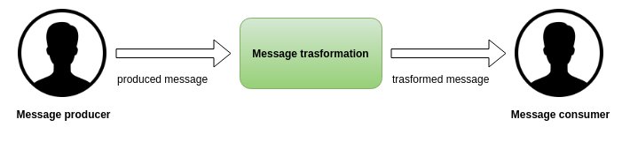
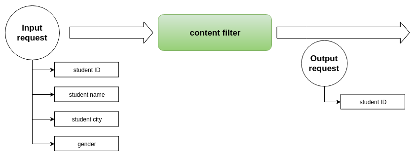
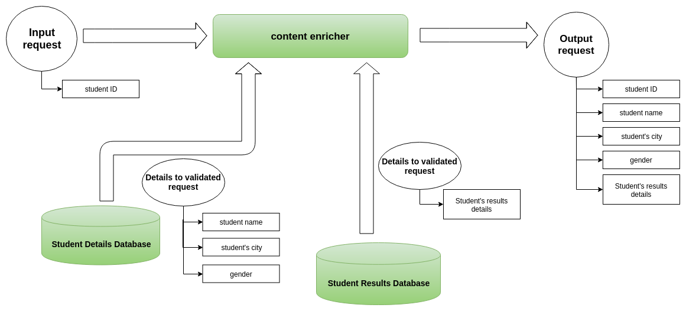
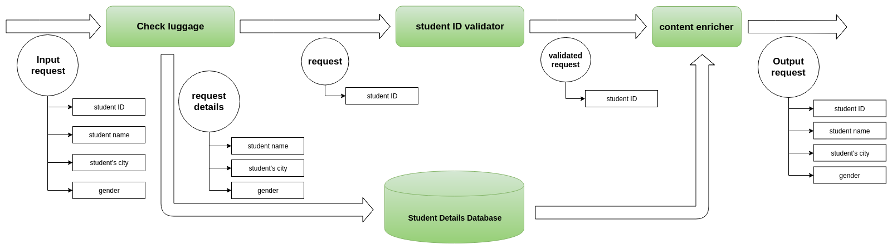

# message-transformation---ballerina
There are different ways of message transformation methods in EIP (Enterprise Integration Patterns). In this guide, we are focusing on *content filter*, *claim check* and *content enricher* message transformation methods between services using an example scenario.

> This guide describes implementing three message trasformation patterns using Ballerina programming language as simple steps.

The following are the sections available in this guide.

- [What you'll build](#what-youll-build)
- [Prerequisites](#prerequisites)
- [Implementation](#implementation)
- [Testing](#testing)
- [Deployment](#deployment)
- [Observability](#observability)

## What you’ll build
When it comes to the data communication, the major challenge is formats of storage mechanisms vary among the systems. 

Also the message producers and consumers uses different techniques according to their requirement. So message transformation play important role to coupling those message producers and the message consumers. 
Not only that, the performance impact while message transformation is also important fact in the real world. Here we discuss about main three message transformation patterns in Enterprise Integration as content filter, content enricher and claim check.

### Content filter
The content filter EIP (Enterprise Integration Pattern) important when we need to manage large message in order to get few data from it. It removes unimportant data items from a message and leaves only the important ones. In addition to removing data elements, Content Filter can be used to simplify a message structure.

In our sample scenario, input request contains lot of student's details. So content filter uses to simplify the input request such as request contains only student ID. Additional data such as student name, student's city and gender will be dropped to ensure the perfomance of messsage transformation.

### Content enricher
The Content Enricher EIP facilitates communication with another system if the message originator does not have all the required data items available. It accesses an external data source to augment a message with missing information.

Content enricher EIP uses to enrich the requst data, in our example it is used to enrich the student's details. We used two databases as student's results details and student's personal details. Using student's ID, it maps the details which belogs to a particular student from the tables and send those to the enricher. Then enricher added particular data to the request.

### Claim check
The Claim Check EIP reduces the data volume of messages sent across a system without sacrificing information content. It stores the entire message at the initial stage of a sequence of processing steps, and it extracts only the parts required by the following steps. Once processing is completed, it retrieves the stored message and performs any operations. This pattern ensures better performance, since large chunks of unwanted data are reduced to lightweight bits before being processed.

The ultimate goal of the claim check EIP in our scenario is to validate the student's ID. Check luggage used to send unwanted data which not uses in validation process, to ths student's detail database. After the validation of student's ID, the original data will addded to the request again.

### Sample scenario
The sample scenario used to demonstrate the above three EI Patterens. Student send a request with content student ID, student name, Student's city and gender. Then ‘content filter’ filters the student name, student's city and gender from the request and added them to a students details database. Filtered request contains only the student ID. Then filtered request goes to the 'Student ID validator'. It validates the incomming request and send the validated request. Then validated request goes to the 'content enricher'. Content enricer uses used two databases as student's results details and student's personal details.
Using student's ID, it maps the details which belogs to a particular student from the tables and added particular data to the request. While addding the enriching data, it process the data using json to json transformation. The output request of the scenario contains student ID, student name, Student's city, gender and student's results details.
